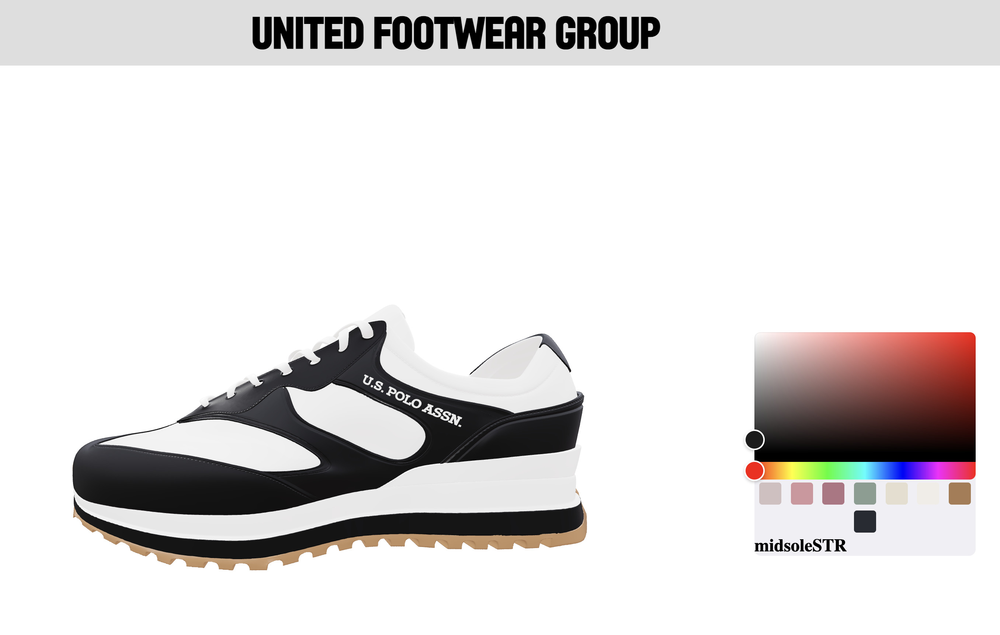

# What is this?

Shoe maker was created to reduce back-and-forth between buyers and designers by providing customizable, dynamic visual representation of products

With Shoe Maker, you can...
    • import 3D models created by blender
    • customize 3D model's color as you like

# How to set up

1. clone the repo
2. npm i
3. npm run start

enjoy customizing your own shoe! 

# How it looks

# Tools used

- Blender
- React Three JS
- React Colorful
- Valtio